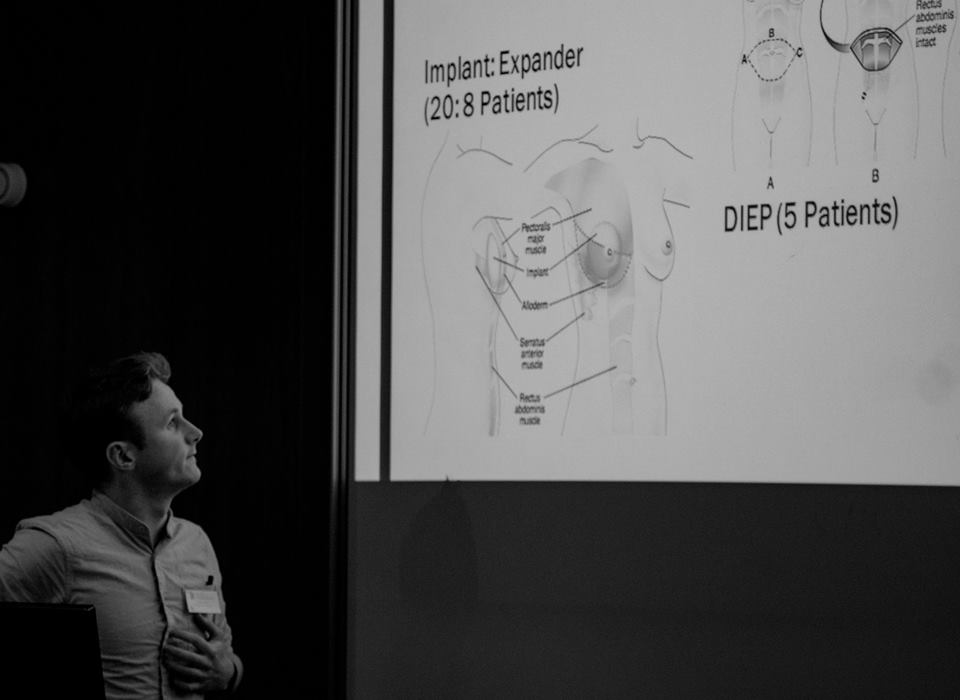

```{r setup, include=FALSE}
knitr::opts_chunk$set(echo = FALSE)
```



Introduction: Bilateral mastectomy and reconstruction is performed for treatment and risk reduction for breast cancer. A cross-sectional study evaluated practice at a tertiary unit in Glasgow, UK.

Method: Patients undergoing mastectomy and reconstruction from 1st January – 31st December 2014 identified from a prospective database. Clinical data gathered from electronic patient records.

Results: 78 reconstructions performed for 39 patients: 35 (90%) immediate; 4 (10%) delayed.

Median age 44 (range 24–68); median BMI 27 (range 19–35); 3 patients (8%) were smokers; none had diabetes. Preoperatively, all but one patient could climb stairs without stopping. Median hospital stay 4 days (range 1–10); no significant perioperative systemic morbidity, no deaths.

Mastectomy indication: 5 (13%) bilateral breast cancer; 13 (33%) unilateral breast cancer; 21 (54%) risk-reducing. Of those who had risk-reducing surgery on one or both sides: 27 (79%) BRCA 1/2 and 7 (21%) high risk non-BRCA. Reconstruction symmetrical for all but one patient: 20 had tissue expanders; 8 implants, 5 DIEP, 4 LD, 1 TUG, 1 pedicled TRAM plus contralateral DIEP. 26 complications requiring unscheduled surgical intervention occurred in 18/39 patients (46%): 6 breast washout/debridement; 6 evacuation of haematoma; 6 donor site washout/re-suture; 5 implants removed for infection; 1 for puncture; 1 port site revision; 1 skin graft. At 12–24 months following initial surgery: 5 (13%) had completed reconstruction; 23 (59%) awaited further surgery (10 expander exchange; 7 lipomodelling; 2 nipple reconstruction; 1 abdominal mesh reinforcement); and 11 (28%) were still under clinic review.

Conclusion: Bilateral breast reconstruction following mastectomy carried no significant systemic morbidity but a high rate of surgical site morbidity and secondary elective surgery.