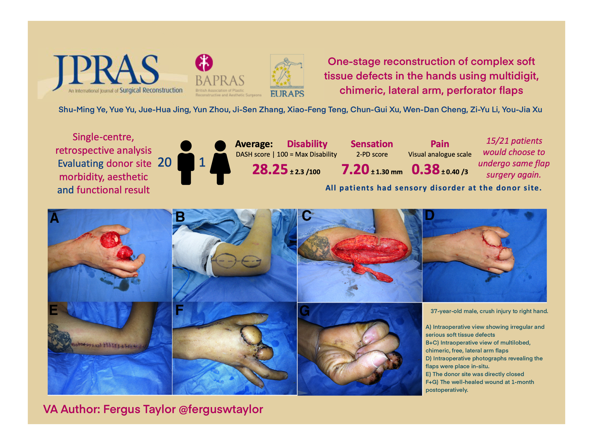

```{r setup, include=FALSE}
Sys.setenv(TZ='GMT')
knitr::opts_chunk$set(echo = FALSE,
                      warning = FALSE,
                      message = FALSE
                      )
```

```{r, include=FALSE}
#PMID/DOI
#Sometime I put the metadata here
```

```{r}
#Libaries.
library(tidyverse)
```



<blockquote class="twitter-tweet" data-lang="en"><p lang="en" dir="ltr">❔What are the solutions you’ve used for complex soft tissue defects of the hand ❔<br><br>❓Chimeric lateral arm flaps❓<a href="https://t.co/4YsrVvbsOU">https://t.co/4YsrVvbsOU</a> <a href="https://t.co/hS8lgEHg4D">pic.twitter.com/hS8lgEHg4D</a></p>&mdash; @JPRAS (@JPRASurg) <a href="https://twitter.com/JPRASurg/status/1142759458310893570?ref_src=twsrc%5Etfw">June 23, 2019</a></blockquote>
<script async src="https://platform.twitter.com/widgets.js" charset="utf-8"></script>
